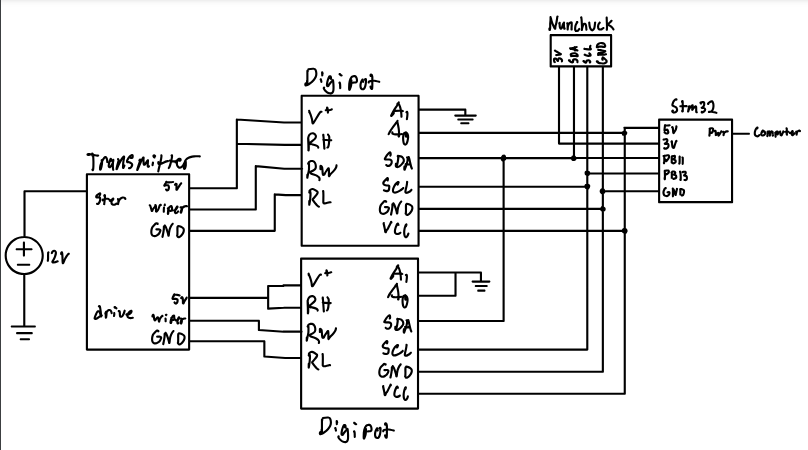
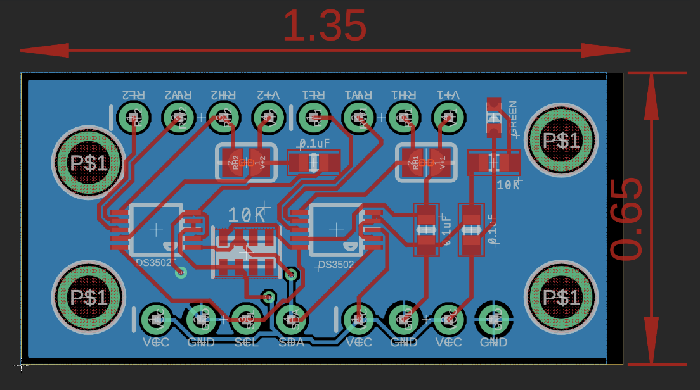
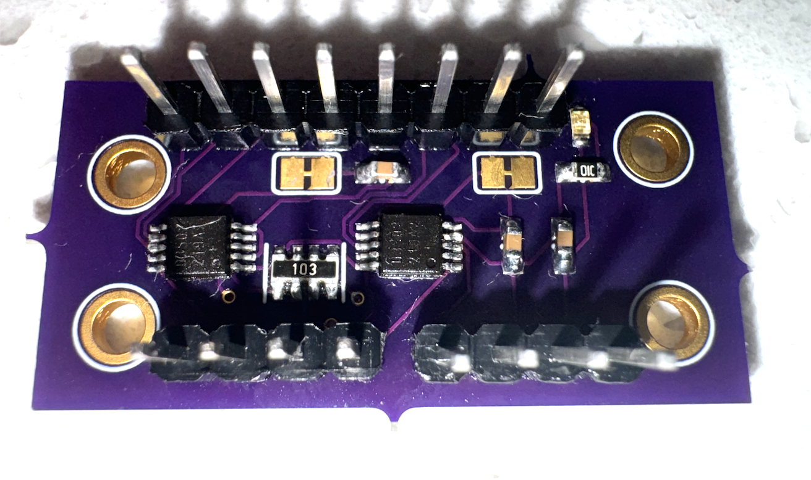
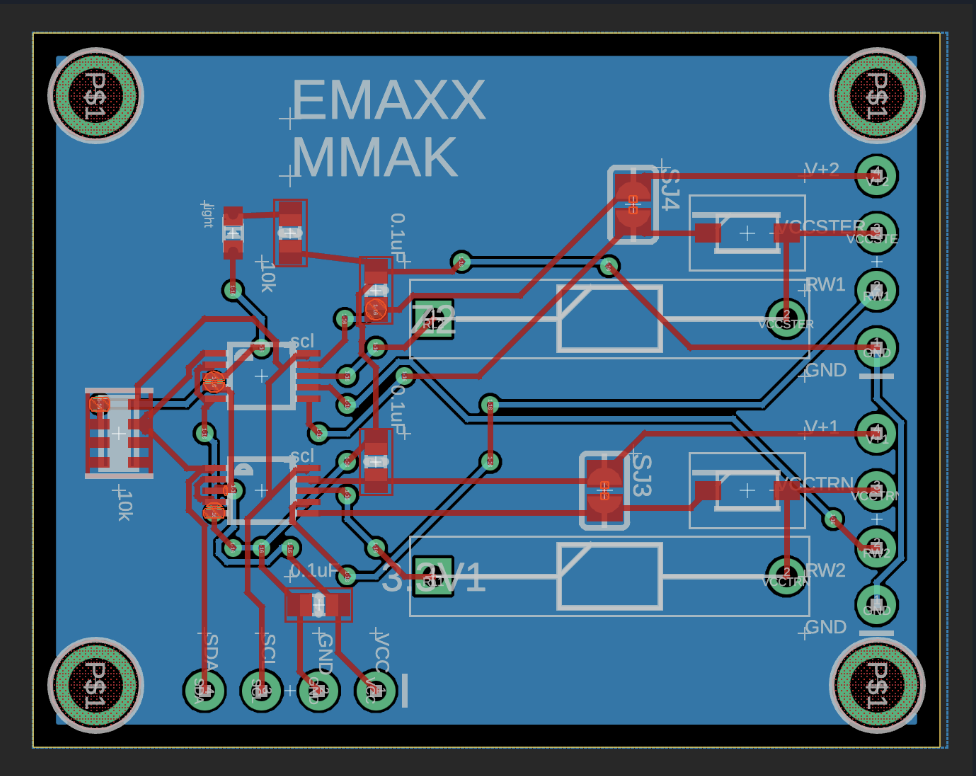
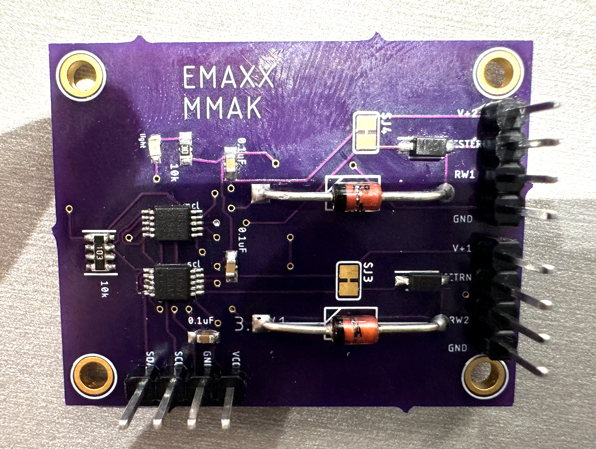
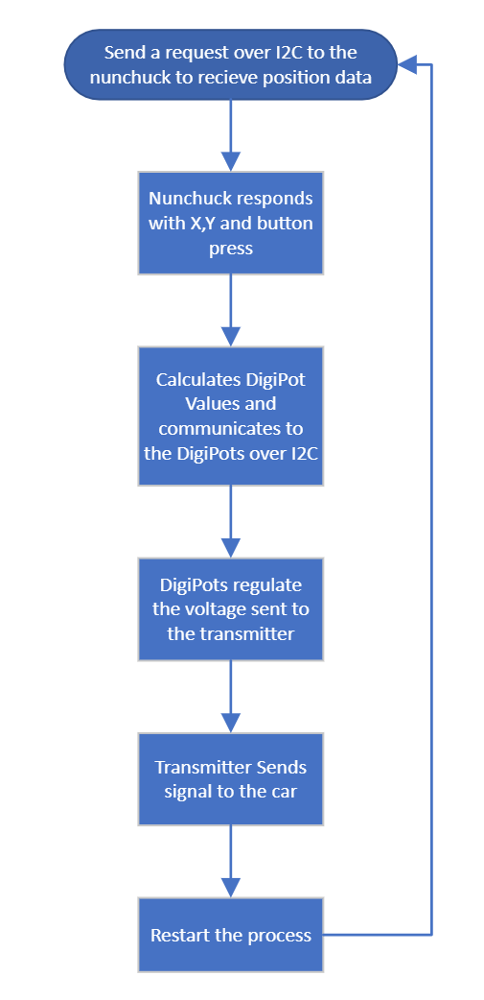

# Mini-Project-RC-Car-Control
Names: 
Alex Cromar,
Kyla Kunz,
Mike Mercer

# E-Maxx Mirage
The motivation for this project stems from our senior project, E-Maxx Mirage, which involves mounting a camera onto the RC car and linking it to a VR headset. In the final version of the senior project, we will be using Xbox wheels and pedals to enhance the driving experience. However, for the sake of simplicity and proof of concept, the initial focus is on implementing a Wii nunchuck to control the car.

# Purpose and Functionality
This project revolves around utilizing a Wii nunchuck to control an RC car. The communication between the Wii nunchuck and the STM microcontroller is through I2C protocol. Interrupts are also be used to enhance the efficiency of the I2C communication process. The input from the Nunchuck is used to change values on the digital potentiometers, which then communicates with the orginal transmitter for the car. Two PCB boards were also created to replace the breadboard, but the boards did not work as expected. The car moves forward by pressing "C", backwards by pressing "Z" and turns left and right based off of the joystick input.

# Instructions
To begin use with the breadboard design the user must connect the stm microcontroller to the following pins. Red 5v to the 5v pin. Black gnd to the gnd pin. Yellow first yellow wire to the SCL pin. Orange wire to SDA pin. Second yellow wire to the 3v pin. 

After connecting all the necessary wires the user must then plug in the transmitter to power and turn on the transmitter. At this point, the LEDs on the breakout boards should be on and the transmitter LED should be on. The user can then turn on the RC car and adjust the trim potentiometers on the transmitter to ensure alignment is correct. After this, the care should be fully functional. The user must make sure that the antenna is not fully extended otherwise radio interference will cause the I2C  Singals to not work properly.
# Wiring Diagram
The wiring diagram for the shematic 

# Schematics
Two schematics were created for this project unfortunately neither design worked and would require a redesign.

This is the schematic for the basic implementation. There is not change being done to the input voltage for the digital potentiometer.

This is the finished version of the first design.

This design utilizes zener diodes to drop the input voltages into the digital potentiometers. 
This was done to decrease the range so that we could input finer granularity into the control of the car.

This is the completed board for the second design.
# Flowcharts
Here is the flow of data over the I2C line.

